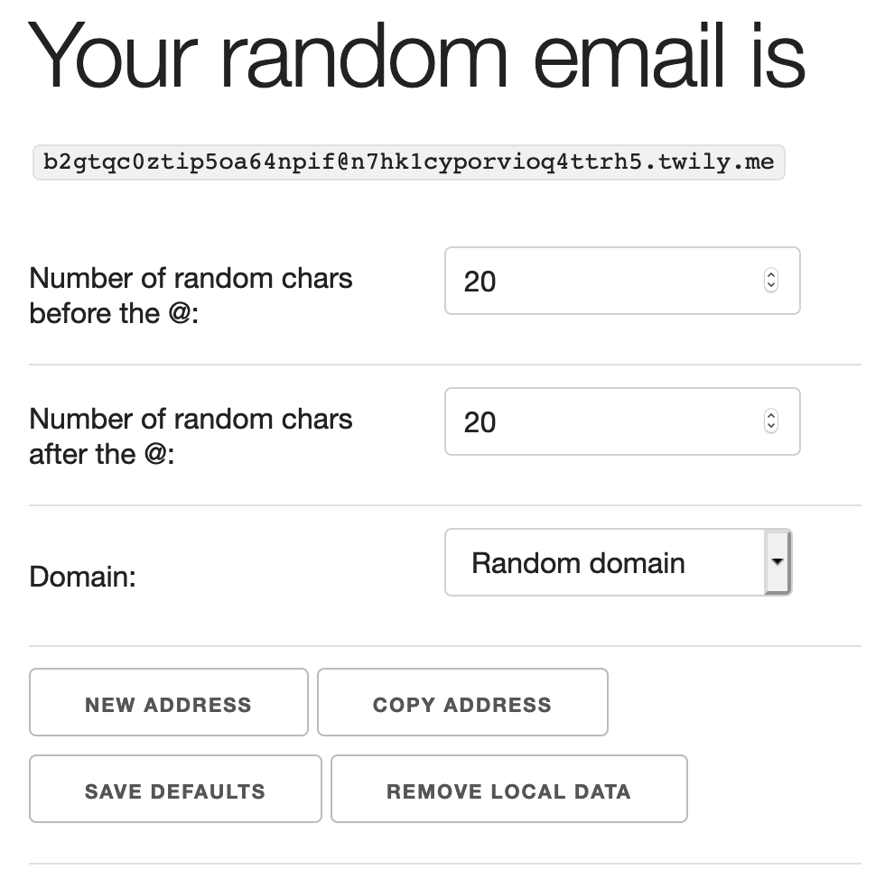

# random-email-generator

Generate randomized email addresses.

Demo (based on example config file): [https://twily.me/random-email-generator-demo/](https://twily.me/random-email-generator-demo/)

## Install instructions

Git clone to your web server

Copy `config.example.js` to `src/assets/config.js` and edit it with your details.

`ln -s /path/to/random-email-generator/src /path/to/website.com/html/random-email-generator`

All is done with JavaScript in browser. No server side code execution.

## Credits

Theme / Styling: [http://getskeleton.com/](http://getskeleton.com/)

Copy function: [https://clipboardjs.com/](https://clipboardjs.com/)
